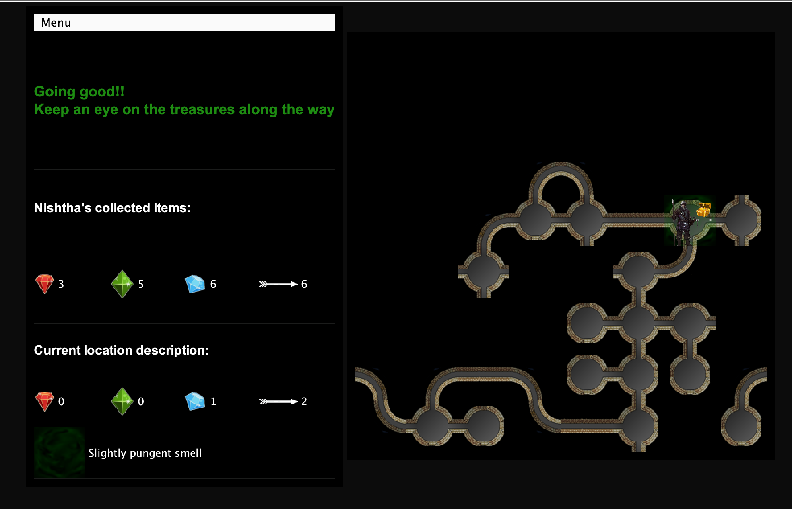

# Graphical Dungeon Adventure

## About/Overview

The world for our game consists of a dungeon, a network of tunnels and caves that are interconnected
so that player can explore the entire world by traveling from cave to cave through the tunnels that
connect them. The dungeon also houses Otyughs that are monsters and are extremely smelly creatures
that lead solitary lives in the deep, dark places of the world like our dungeon.

Consider the following example:

This is an example of 8 x 8 two-dimensional dungeon. Each location in the grid represents a location
in the dungeon where a player can explore and can be connected to at most four (4) other locations:
one to the north, one to the east, one to the south, and one to the west. Notice that in this
dungeon some locations "wrap" to the one on the other side of the grid. For example, moving to the
west from row 6 (the second bottom) in the grid moves the player to the location in the same row in
column 8 (at the right). A location can further be classified as tunnel (which has exactly 2
entrances) or a cave (which has 1, 3 or 4 entrances). In the dungeon above, each of the elements
like player, cave, tunnel, monster, treasure etc are represented by images. Some of them are visible
in the example.

In many games, these dungeons are generated at random following some set of constraints resulting in
a different network each time the game begins. Following are the constraints of the dungeon:

1. The dungeon should be able to be represented on a 2-D grid.
2. There should be a path from every cave in the dungeon to every other cave in the dungeon.
3. Each dungeon can be constructed with a degree of interconnectivity. We define an
   interconnectivity = 0 when there is exactly one path from every cave in the dungeon to every
   other cave in the dungeon. Increasing the degree of interconnectivity increases the number of
   paths between caves.
4. Not all dungeons "wrap" from one side to the other (as defined above).
5. One cave is randomly selected as the start and one cave is randomly selected to be the end. The
   path between the start and the end locations should be at least of length 5.

## List of features

Graphical interface -

1. A graphical interface is provided for the users to enjoy the game. The game has mainly two
   sections, on the left - the description panel where player and current location description are
   shown and on the right panel the dungeon itself is represented.
2. The first window users get is to set up the dungeon. 
3. The game starts with only the starting cabe being visible and then the dungeon starts unfolding
   itself as you explore around it.
4. The current location of the player always displays any treasures, arrows, smell, monster or a
   dead monster in case they have it.
5. To move around the dungeon you can either click on the adjacent locations (even if not visible)
   or you can take benefit of the up, down, left and right keys on your keyboard.
6. To pick up all the rubies present at the location you can press 'R', similarly for emeralds 'E',
   diamonds 'D', all treasures 'T', arrows 'A' and 'P' to pick up both treasures and arrows.
7. To shoot an arrow, you can press 'S' followed by a direction key from your keyboard. You'll then
   get a popup to enter the distance you intend to shoot.
8. You miss a shot, or it's a hit, either ways you'll be notified at the description panel.
9. If you are out of arrows, you'll get a popup to notify you about it and it'll also be visible in
   the description panel.
10. Once, you are near a monster you can see the cave filled with light green for less pungent smell
    or dark green for more intense strongly pungent smell.
11. You win, or you lose, you'll get a popup to notify you about it.
12. The description panel also has a Menu bar that has options to restart the game with the same
    dungeon, create a new game or to simply quit it.

## How to Run

1. For graphical dungeon - Simply run the jar.

2. To run console based game -

<pre>
java -jar ./res/Dungeon.jar command-line arguements
</pre>
Note that, to play the console version, you need to provide exactly 7 command line arguments for the
dungeon as explained in next point or the graphical game would run.

2. To run graphical game -

<pre>
java -jar .res/Dungeon.jar
</pre>

## How to Use the Program

1. For console based game -

Run the jar file (Refer "How to Run") with the command line arguments.

Consider the following example:

<pre>
java -jar res/Dungeon.jar 5 4 2 y 57 Nishtha 2
</pre>

1. 5 is the number of rows of the dungeon.
2. 4 is the number of columns of the dungeon.
3. 2 is the interconnectivity of the dungeon.
4. y indicates that the dungeon is wrapping. Anything other than "y" or "Y" results in a non
   wrapping dungeon.
5. 57 is the percentage of caves to have treasures in the dungeon and the percentage of locations
   (both caves and tunnels) to have arrows.
6. Nishtha is the player name.
7. 2 is the number of monsters

After the initial setup of the model through command line arguements, you'll play an interactive
game using the controller.

Consider the below example -
<pre>
Welcome to the World of Dungeon
Number of rows: 5
Number of columns: 4
Interconnectivity: 4
Is model.dungeon wrapping: true
Percentage of caves to have treasures: 57.0
Player name: Captain
Number of monsters: 2

You are in a cave
You find 2 diamonds 1 sapphire here.
You find 2 arrows here.
Doors lead to [N, W, E]
Move, Pickup, or Shoot (M-P-S)?P
What?diamond

You pick up 2 diamonds
You are in a cave
You find 1 sapphire here.
You find 2 arrows here.
Doors lead to [N, W, E]
Move, Pickup, or Shoot (M-P-S)?P
What?treasure

You pick up 1 sapphire
You are in a cave
You find 2 arrows here.
Doors lead to [N, W, E]
Move, Pickup, or Shoot (M-P-S)?p
What?ARROW

You pick up 2 arrows
You are in a cave
Doors lead to [N, W, E]
Move, Pickup, or Shoot (M-P-S)?M
Where to?W

You smell something lightly pungent here.
You are in a cave
You find 1 diamond 1 sapphire here.
Doors lead to [N, W, S, E]
Move, Pickup, or Shoot (M-P-S)?P 
What?Treasure

You smell something lightly pungent here.
You are in a cave
Doors lead to [N, W, S, E]
Move, Pickup, or Shoot (M-P-S)?m
Where to?s

You smell something terribly pungent here.
You are in a tunnel
You find 2 arrows here.
Doors lead to [N, W]
Move, Pickup, or Shoot (M-P-S)?s
No. of caves (1-n)?1
Where to?n
You shoot an arrow into the darkness

You smell something terribly pungent here.
You are in a tunnel
You find 2 arrows here.
Doors lead to [N, W]
Move, Pickup, or Shoot (M-P-S)?s
No. of caves (1-n)?1
Where to?w
You hear a great howl in the distance

You smell something terribly pungent here.
You are in a tunnel
You find 2 arrows here.
Doors lead to [N, W]
Move, Pickup, or Shoot (M-P-S)?s
No. of caves (1-n)?1
Where to?w
You hear a great howl in the distance

You are in a tunnel
You find 2 arrows here.
Doors lead to [N, W]
Move, Pickup, or Shoot (M-P-S)?m
Where to?w

You are in a cave
You find a dead Otyugh here.
You find 2 sapphires here.
You find an arrow here.
Doors lead to [W, S, E]
Move, Pickup, or Shoot (M-P-S)?
.
.
.

You are in a tunnel
Doors lead to [N, E]
Move, Pickup, or Shoot (M-P-S)?m
Where to?e

Congratulations!! You won.
Destination Reached.
</pre>

1. You are greeted by a welcome message and all the specifications of your dungeon entered through
   command line.
2. The smell is printed if your location has a smell because of the Otyugh.
3. The information about current location is printed (if it's a cave or a tunnel, any treasures it
   has or any arrows present).
4. You are given three options M, P or S that means Move, Pick or Shoot.
5. Using M, you can move to the next location by entering the direction.
6. Using P, you can pick treasures or arrows. To pick rubies present in the location type "ruby",
   for diamonds "diamond", for sapphires "sapphire" and to pick all treasures at once, enter "
   treasure".
7. To pick arrows, enter "arrow" and all the arrows present at the current location will be picked.
8. Using S, you can shoot arrows to kill the monster. You'll be prompted to enter the number of
   caves and the direction.
9. If you enter a cave with a dead Otyugh, you'll be notified.
10. If you enter a cave with injured Otyugh and survive, you'll be notified.
11. You'll be notified when you win and reach the destination.
12. If you're eaten by an Otyugh and lose you'll get the below message -

<pre>
Chomp, chomp, chomp, you are eaten by an Otyugh!
Better luck next time
</pre>

13. All the inputs are case insensitive.
14. For any wrong input, you'll be notified and the game will continue from the current position.

## Description of Examples

No sample runs for the graphical game but below are some sample runs for the console based game.

##### player_lose_run.txt

1. Prints an introduction.
2. Prints the user entered number of rows = 5, number of columns = 4, interconnectivity = 4, if the
   dungeon is wrapping or not = y, the percentage of caves to have treasures in the dungeon = 57,
   the percentage of locations to have arrows = 57 and player name = "Captain".
3. Prints the current location description including if it's a cave or a tunnel and all the
   treasures and arrows present.
4. Prints where the doors lead to from current location.
5. Prompts for an input (M, P or S).
6. If M, prompts for direction and moves the player in case of a valid direction.
7. If player moves in a cave with a monster, the player is killed and that is printed.
8. If P, prompts for what to pick and picks if input is valid.
9. If S, prompts for distance and direction and shoots in case of valid input.
10. Prints if the shot hit the monster or the arrow was shot into darkness and didn't hit.
11. Repeats steps 3 to 10 until the player is eaten by the monster.

##### player_win_run.txt

1. Prints an introduction.
2. Prints the user entered number of rows = 5, number of columns = 4, interconnectivity = 4, if the
   dungeon is wrapping or not = n, the percentage of caves to have treasures in the dungeon = 57,
   the percentage of locations to have arrows = 57 and player name = "Captain".
3. Prints the current location description including if it's a cave or a tunnel and all the
   treasures and arrows present.
4. Prints where the doors lead to from current location.
5. Prompts for an input (M, P or S).
6. If M, prompts for direction and moves the player in case of a valid direction.
7. If player moves in a cave with a monster, the player is killed and that is printed.
8. If P, prompts for what to pick and picks if input is valid.
9. If S, prompts for distance and direction and shoots in case of valid input.
10. Prints if the shot hit the monster or the arrow was shot into darkness and didn't hit.
11. Repeats steps 3 to 10 until the player is win and reaches the destination.

## Design/Model Changes

1. No model changes were required from the last project.
2. In my initial design for this project, I intended to extend only one JPanel, but later I felt the
3. need to extend a JPanel for description as well.
4. A completely new asynchronous controller is built.

## Assumptions

1. A dungeon that cannot have a minimum distance of 5 between any two nodes is not a valid dungeon.
2. User has to enter a direction every time in order for the player to move.
3. Once a treasure is collected from the location it is removed from the location, so in case a user
   comes back to that location the already collected treasures will not be available at the location
   anymore.
4. Once the player shoots an arrow, the player cannot pick it again even if it does not hit the
   monster.
5. A location can have more than 1 arrows. A can can have 1 or 2 arrows.
6. Once the player reaches the destination cave, the game ends and the player cannot take any action
   after that.

## Limitations

The project covers all the functionalities given in the project description. Although, there can be
a few limitations -

1. There are only three treasures available.
2. The user needs to check if the destination is reached or not in order to stop the game.
3. Based on the user inputs, there can be too small dungeons for which the dungeon will not be
   created and the user will get an exception. So the user needs to be aware about the constraints
   of creating the dungeon.
4. The player gets to know of the dead Otyugh once the player enters the cave with a dead Otyugh.
   Although, when a shot is successful player can hear the monster howl and the smell from the
   monster is no more there.
5. You can only pick and shoot using a keyboard.

## Citations

1. Effective Java - https://learning.oreilly.com/library/view/effective-java/9780134686097/
2. Head First Design Patterns
    - https://learning.oreilly.com/library/view/head-first-design/9781492077992/
3. https://www.geeksforgeeks.org/kruskals-minimum-spanning-tree-algorithm-greedy-algo-2/
4. https://www.geeksforgeeks.org/shortest-distance-two-cells-matrix-grid/

